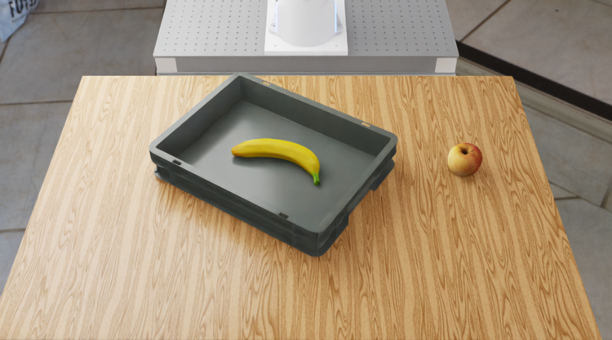

# Agentic VLA System for Open-Vocabulary Long-Horizon Robotic

Reproducing a closed loop of task decomposition, action execution, and visual progress monitoring in RoboVoLo using **pretrained π0.5 and a remote vision-language model (VLM)**, without training or fine-tuning.

**Result (2026-09-06): the L11 fruit-swapping task completed successfully with `success=true` and a score of 1.0, compared with 0.5 for the baseline.** Each configuration was run once; these results demonstrate feasibility, not a statistical success rate.

## 1. Objective

L11 `SwapBinReplaceFruitsTask` requires moving a banana from a container onto the table, then placing the apple on the table into the container. The robot must execute the steps in order and determine when to switch goals.

This project compares passing the full instruction directly to π0.5 with using a VLM to decompose the task into subgoals and monitor progress during π0.5 execution.



## 2. System Workflow

```text
RoboLab + RoboVoLo (observations and action execution)
          │ observations ↑↓ actions
     VoLoAgent (task orchestration)
          ├── Remote VLM: subgoal decomposition and progress checks
          └── openpi π0.5: actions from current instructions and observations
```

The VLM uses the front camera to assess progress; π0.5 uses side and wrist camera views for manipulation. The normal configuration enables subgoal decomposition, VLM monitoring, and replanning, but **no replanning was triggered** in the successful run. Failure recovery remains unverified.

### Recorded Task Prompt and Execution Trace

The successful run (`l11_normal_20260906T112758Z`) used this exact task instruction:

> Take the item out of the container and place it on the table. Then put the item that was on the table into the container.

The VLM generated four ordered subgoals (`ordered=true`), resolving the instruction's unnamed items from the scene:

1. `Pick up the banana from the grey container`
2. `Place the banana on the wooden table`
3. `Pick up the apple from the wooden table`
4. `Place the apple into the grey container`

**Recorded calls and decisions.** The trace contains one `decompose` event and five `vlm_detect` events; episode metadata records 57 agent inference requests. These are orchestration events and structured VLM decisions, rather than an archived API `tool_calls` transcript. The full VLM system prompt and request payloads are not included in these artifacts.

| Event | Logged `step_count` | Current subgoal | VLM status → action | Recorded assessment (summarized) |
|---|---|---|---|---|
| `decompose` | — | Full task → subgoals 1–4 | `ordered=true` | Pick and place the banana, then pick and place the apple |
| `vlm_detect` | 10 | 1. Pick up banana | `complete` → `next` | Banana grasped and lifted out of the container |
| `vlm_detect` | 20 | 2. Place banana | `in_progress` → `continue` | Banana still held; placement not complete |
| `vlm_detect` | 30 | 2. Place banana | `complete` → `next` | Banana placed on the table |
| `vlm_detect` | 40 | 3. Pick up apple | `in_progress` → `continue` | Apple still on the table |
| `vlm_detect` | 50 | 3. Pick up apple | `complete` → `next` | Apple picked up; advance to placement |

`step_count` is the counter stored in the agent trace, separate from the evaluator's 853 simulation steps. Assessments above summarize the VLM's reported observations. `continue` keeps the current subgoal; `next` advances to the next one. No recovery or replanning event was recorded.

For example, the first progress check contains these fields (excerpt):

```json
{
  "type": "vlm_detect",
  "subgoal_idx": 0,
  "subgoal": "Pick up the banana from the grey container",
  "status": "complete",
  "action": "next",
  "step_count": 10
}
```

After switching to subgoal 4, the simulation evaluator ended the episode with `success=true` and `Completed subtask 'pick_and_place' 2/2`. There is no separate VLM completion check for subgoal 4 in the saved trace. The evaluator's two task steps and the VLM's four subgoals use different levels of granularity.

Sources: [episode metadata](results/l11_normal_20260906T112758Z/Take_the_item_out_of_the_container_and_place_it_on_the_table_Then_put_the_item_t/episode_1/metadata.json), [decomposition and VLM decision trace](results/l11_normal_20260906T112758Z/Take_the_item_out_of_the_container_and_place_it_on_the_table_Then_put_the_item_t/episode_1/rewrites.jsonl), and [final evaluation](results/l11_normal_20260906T112758Z/episode_results.jsonl).

## 3. Results

Both experiments used L11, seed=0, and a single environment, with one episode per configuration. Success is determined by the simulation evaluator.

| Metric | Baseline: full instruction | Normal: VLM decomposition and monitoring |
|---|---|---|
| Task success / score | false / 0.5 | **true / 1.0** |
| Simulation steps / time | 900 / 60.0 s | 853 / 56.9 s |
| Action-loop wall time | 145.5 s | 165.4 s |
| Final status | Apple-grasp condition not met | Both task steps completed |
| Raw evaluation | [JSONL](results/l11_baseline_20260906T100957Z/episode_results.jsonl) | [JSONL](results/l11_normal_20260906T112758Z/episode_results.jsonl) |
| Full demonstration | [Video](results/l11_baseline_20260906T100957Z/robolab_output/SwapBinReplaceFruitsTask/Take_the_item_out_of_the_container_and_place_it_on_the_table_Then_put_the_item_that_was_on_the_table_into_the_container_0.mp4) | [Video](results/l11_normal_20260906T112758Z/robolab_output/SwapBinReplaceFruitsTask/Take_the_item_out_of_the_container_and_place_it_on_the_table_Then_put_the_item_that_was_on_the_table_into_the_container_0.mp4) |

In the normal run, the VLM performed one task decomposition and five progress checks, guiding the robot to remove the banana and then place the apple into the container. This validates the multi-step execution loop for this run. Evaluation across more seeds and tasks, along with fault injection and replanning tests, is needed to assess reliability and recovery.

### Control and VLM Timing

Timing for the successful normal run. Simulation rates describe virtual time; wall-clock measurements describe actual elapsed time.

| Metric | Value | Time basis |
|---|---|---|
| Physics simulation rate | 120 Hz | Simulation time |
| Action control rate | 15 Hz (one control step every 66.7 ms) | Simulation time |
| Measured control-loop throughput | 5.16 steps/s | Wall clock, including inference, simulation, and video writing |
| VLM progress-check interval | 28.7 s on average | Wall clock between consecutive logged checks |
| VLM progress-check latency | 4.23 s on average (3.65–5.15 s) | Wall clock per check |
| VLM calls per episode | 1 decomposition + 5 progress checks | Recorded events; no replanning |

Sources: [simulation configuration](results/l11_normal_20260906T112758Z/robolab_output/SwapBinReplaceFruitsTask/env_cfg.json), [evaluation timing](results/l11_normal_20260906T112758Z/episode_results.jsonl), and [VLM event timestamps](results/l11_normal_20260906T112758Z/Take_the_item_out_of_the_container_and_place_it_on_the_table_Then_put_the_item_t/episode_1/rewrites.jsonl). VLM intervals are observed averages, not a fixed wall-clock schedule.

## 4. Reproduction

Validated environment: **RTX 4090 24GB, Ubuntu 24.04, Isaac Sim 5.1.0, Isaac Lab 2.3.2.post1, and Python 3.11.15**. Simulation, π0.5, and VLM orchestration run in three separate Python environments.

This repository contains scripts, patches, configuration files, and selected results. Upstream source code, model weights, and large assets must be prepared separately. See the [detailed reproduction guide (Chinese)](README-archive.md) for installation steps, pinned versions, and machine-specific notes. The scripts currently depend on a `/workspace` layout and Vast supervisor setup; other hosts require adjustments.

After installation, service configuration, and VLM validation, run:

```bash
bash /workspace/volo_repro/scripts/run_experiment.sh baseline
bash /workspace/volo_repro/scripts/run_experiment.sh normal
```

| Directory / File | Contents |
|---|---|
| [scripts/](scripts/) | Simulation smoke tests, service startup, health checks, experiments, and checkpoint verification |
| [results/](results/) | Scene images, evaluation data, agent events, and videos |
| [manifests/](manifests/) / [overlays/](overlays/) | Source patches, version records, and dependency lockfiles, including historical configurations |
| [supervisor/](supervisor/) | Service management configuration |
| [codex.md](codex.md) | Detailed execution and troubleshooting log |

Built on [RoboLab](https://github.com/NVlabs/RoboLab), [RoboVoLo](https://github.com/NVlabs/RoboVoLo), [VoLoAgent](https://github.com/NVlabs/VoLoAgent), and [xuningy/openpi](https://github.com/xuningy/openpi). Upstream code and assets remain subject to their respective licenses.
